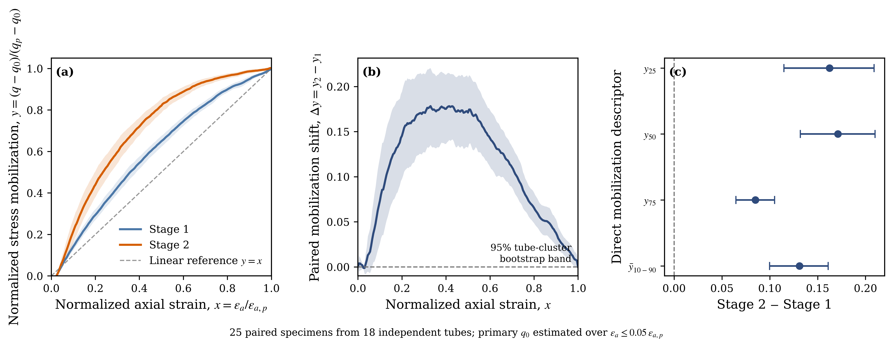
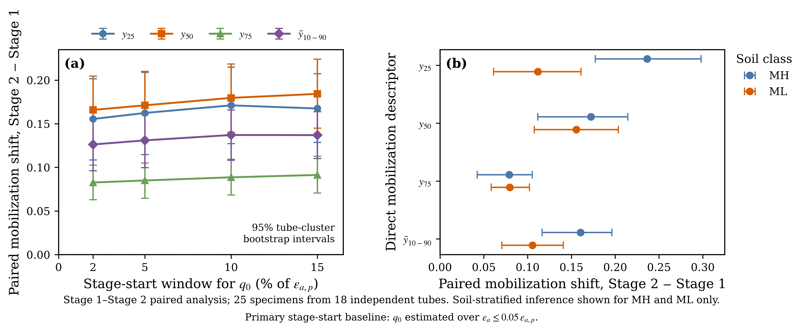
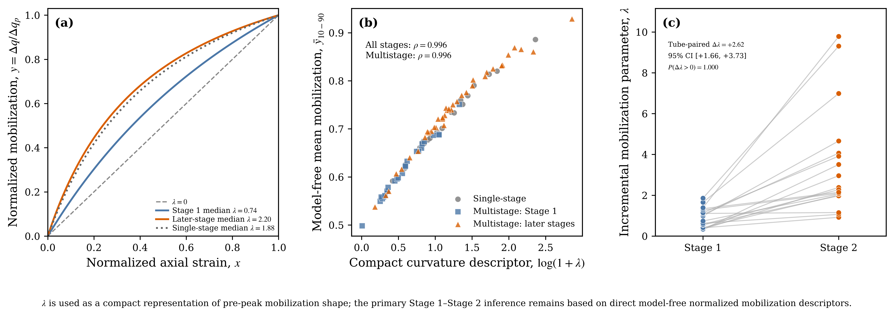

# UnsatConstitutiveLab

## Laboratory-Calibrated Constitutive Modelling of Unsaturated Soil under Triaxial Stress Paths

**UnsatConstitutiveLab** is a reproducible computational study of
laboratory unsaturated triaxial data for natural residual soils.

The project combines:

- source-anchored reconstruction of published stress-strain curves;
- suction-dependent shear-strength modelling;
- constitutive parameter calibration;
- leave-one-tube-out predictive validation;
- paired multistage stress-path analysis;
- tube-clustered bootstrap uncertainty;
- falsification and sensitivity testing; and
- model-free confirmation of the primary constitutive-response finding.

The central result is a robust **within-specimen shift toward earlier
normalized pre-peak stress mobilization from Stage 1 to Stage 2** under
the investigated multistage unsaturated triaxial protocol.

---

## Research question

> **How well can laboratory-calibrated constitutive descriptions reproduce
> and predict the suction-dependent strength and stress-strain response of
> unsaturated residual soil across different stress states, and what
> additional information is carried by multistage loading history?**

---

# Scientific motivation

Unsaturated soil response depends on both mechanical stress and hydraulic
state.

Matric suction can contribute substantially to apparent strength, while
changes in saturation and loading path can affect the measured
stress-strain response.

Multistage triaxial testing is attractive because several stress states
can be obtained from a single specimen. However, successive stages are
not necessarily mechanically equivalent to independent virgin tests.

This project therefore addresses two related problems:

1. how hydraulic-state information contributes to prediction of
   unsaturated residual-soil strength and stress-strain response; and
2. whether normalized pre-peak mobilization evolves systematically
   between consecutive stages of a multistage test.

---

# Experimental source

Primary experimental source:

**C.-T. Tang, R. H. Borden, and M. A. Gabr**

*Model Applicability for Prediction of Residual Soil Apparent Cohesion*

Transportation Geotechnics, 19 (2019), 44–53.

Dataset DOI:

**10.17632/p9tmzckdpt.1**

The archived material contains tabulated test conditions, soil-state
variables, peak responses, soil-water retention information, and full
stress-strain plots.

The broader Appendix F inventory used in this project contains:

- **46 unsaturated triaxial specimens/tests**
- **20 single-stage specimens**
- **26 multistage specimens**
- **86 stage-level strength observations**
- **36 unique source tubes**

This repository performs a **secondary computational analysis** of the
experimental archive.

The original paper should not be interpreted as having reported the
full-curve constitutive findings developed here.

---

# Analysis workflow

```text
Published laboratory archive
            |
            v
Source and variable audit
            |
            v
Stress-strain figure reconstruction
            |
            v
Stage-level experimental database
            |
            +---------------------------+
            |                           |
            v                           v
Unsaturated strength             Full-curve constitutive
modelling                        response modelling
            |                           |
            v                           v
Tube-wise prediction             Curve parameters
            |                           |
            +-------------+-------------+
                          |
                          v
              Paired multistage analysis
                          |
                          v
                  Falsification tests
                          |
                          v
           Model-free robustness analysis
                          |
                          v
              Publication-quality figures
```

---

# Data reconstruction

## Peak-stress definition

The source stress-strain plots explicitly report **deviatoric stress**
\(q\).

Accordingly,

\[
q_p = q_{\mathrm{source\ peak}},
\]

with no additional subtraction of net confining stress.

This interpretation was independently checked against specimen ST-36:

- source peak: **264.5 kPa**
- reconstructed peak: **approximately 266 kPa**
- peak discrepancy: **approximately 0.6%**

---

## Full stress-strain reconstruction

A source-anchored digitization workflow was developed for the Appendix F
figures.

Final coverage:

- **46 figures audited**
- **45 figures retained as usable**
- **84 stage curves reconstructed**
- **45 unique specimens represented**

Peak-stress reconstruction quality:

- median absolute discrepancy: **~0.43%**
- 90th-percentile absolute discrepancy: **~2.2%**

Strain-axis confidence was tracked explicitly.

Some figures permitted direct tick-based calibration, whereas others
required template-based strain mapping.

For this reason, absolute stiffness and absolute strain quantities are
treated more cautiously than scale-invariant normalized mobilization
descriptors.

---

# Unsaturated strength modelling

A conventional Fredlund-type strength representation was evaluated:

\[
\tau_f
=
c'
+
(\sigma-u_a)\tan\phi'
+
(u_a-u_w)\tan\phi^b.
\]

where:

- \(c'\) is a fitted cohesion-related term;
- \(\phi'\) is a fitted friction-related parameter;
- \(u_a-u_w\) is matric suction; and
- \(\phi^b\) describes the fitted suction-related strength contribution.

The fitted quantities are interpreted as **equivalent fitted strength
parameters**, rather than universally transferable fundamental material
constants.

Predictive performance was evaluated using
**leave-one-tube-out cross-validation**.

This is intentionally stricter than random train-test splitting:
all observations originating from the held-out source tube remain unseen
during calibration.

Hydraulic-state descriptions were compared with simpler
mechanical and suction-only alternatives.

---

# Constitutive representation of pre-peak response

For each loading stage, the pre-peak response is normalized as

\[
x
=
\frac{\varepsilon_a}
     {\varepsilon_{a,p}},
\]

and

\[
y
=
\frac{q-q_0}
     {q_p-q_0},
\]

where:

- \(\varepsilon_a\) = axial strain;
- \(\varepsilon_{a,p}\) = stage-specific axial strain at peak;
- \(q\) = deviatoric stress;
- \(q_0\) = stage-start deviator-stress baseline; and
- \(q_p\) = stage-specific peak deviator stress.

Thus,

\[
(x,y)=(0,0)
\]

represents the normalized stage start, while

\[
(x,y)=(1,1)
\]

represents the stage-specific peak.

---

## Compact mobilization parameter

A one-parameter hyperbolic representation is used:

\[
y
=
\frac{x(1+\lambda)}
     {1+\lambda x}.
\]

The parameter \(\lambda\) describes the curvature of pre-peak stress
mobilization.

In practical terms:

- smaller \(\lambda\) corresponds to more gradual mobilization;
- larger \(\lambda\) corresponds to a greater fraction of peak strength
  being mobilized earlier in normalized strain space.

Across the **84 reconstructed stages**:

- median pre-peak normalized fitting error: **~3.2%**
- 90th-percentile fitting error: **~5.5%**

The hyperbolic relation is used as a **compact constitutive descriptor**,
not as a proposed universal constitutive law.

---

# Primary finding

The strongest test compares **Stage 1 and Stage 2 within the same
multistage specimen**.

Final paired sample:

- **25 Stage-1/Stage-2 specimen pairs**
- **18 independent source tubes**

Statistical uncertainty is evaluated by resampling at the **tube level**.

This avoids treating multiple specimens or stages from the same source
tube as fully independent observations.

---

## Model-free mobilization descriptors

The primary scientific result does not rely on the fitted
\(\lambda\) parameter.

Direct normalized mobilization is evaluated at:

\[
x=0.25,\qquad
x=0.50,\qquad
x=0.75.
\]

These produce:

\[
y_{25},\qquad
y_{50},\qquad
y_{75}.
\]

A mean normalized mobilization descriptor is also evaluated over:

\[
0.10 \le x \le 0.90.
\]

Using the primary definition of \(q_0\):

\[
\Delta y_{25}
=
+0.162,
\]

with 95% tube-cluster bootstrap interval:

\[
[+0.115,\,+0.209].
\]

At half normalized peak strain:

\[
\boxed{
\Delta y_{50}
=
+0.171
}
\]

with

\[
\boxed{
95\%\ \mathrm{CI}
=
[+0.132,\,+0.210]
}
\]

and **92% of paired specimens** showing a positive shift.

At

\[
x=0.75,
\]

the effect remains positive:

\[
\Delta y_{75}
=
+0.085,
\]

with

\[
95\%\ \mathrm{CI}
=
[+0.065,\,+0.105].
\]

For the complete normalized interval:

\[
\boxed{
\Delta\bar y_{10-90}
=
+0.131
}
\]

with

\[
\boxed{
95\%\ \mathrm{CI}
=
[+0.100,\,+0.161].
}
\]

---

## Interpretation

Under the investigated multistage protocol:

> **Stage 2 mobilizes a larger fraction of its own stage-specific peak
> deviator-stress increment at the same normalized axial strain than
> Stage 1.**

This behaviour is described here as:

**earlier normalized pre-peak stress mobilization.**

The result should **not** automatically be interpreted as intrinsic
material hardening.

Potential contributing processes may include prior shearing,
stress-path evolution, termination/reloading procedure, accumulated
plastic deformation, fabric evolution, or combinations of these effects.

The available dataset does not uniquely isolate the physical mechanism.

---

# Figure 01 — Primary multistage response



Figure 01 shows:

- normalized Stage-1 and Stage-2 mean responses;
- tube-cluster bootstrap uncertainty;
- the paired mobilization difference \(\Delta y(x)\); and
- principal direct effect-size descriptors.

The positive difference is strongest through the central part of the
normalized pre-peak path and returns to zero at the normalized peak by
definition.

---

# Robustness and falsification

The Stage-1 to Stage-2 result was deliberately subjected to several
alternative explanations and sensitivity tests.

---

## Stage-start stress definition

The primary analysis estimates \(q_0\) from the earliest 5% of
stage-specific peak strain.

The complete calculation was repeated using windows of:

- **2%**
- **5%**
- **10%**
- **15%**

of \(\varepsilon_{a,p}\).

The direction and practical magnitude of the Stage-1 to Stage-2 shift
remain stable.

For example,

\[
\Delta y_{50}
\]

remains approximately:

\[
+0.166
\text{ to }
+0.184.
\]

All corresponding 95% tube-cluster bootstrap intervals remain above zero.

---

## Soil-class stratification

The paired shift is independently present in the two major soil subsets.

For **MH** soils:

\[
\Delta\bar y_{10-90}
\approx
+0.160,
\]

with approximately

\[
95\%\ \mathrm{CI}
=
[+0.117,\,+0.196].
\]

For **ML** soils:

\[
\Delta\bar y_{10-90}
\approx
+0.105,
\]

with approximately

\[
95\%\ \mathrm{CI}
=
[+0.071,\,+0.141].
\]

The result is therefore not carried entirely by one major soil class.

SC is not assigned the same inference because the number of independent
SC tubes is insufficient for comparable stratified analysis.

---

# Figure 02 — Robustness and soil stratification



Figure 02 summarizes:

- sensitivity to alternative \(q_0\) definitions; and
- separate MH and ML Stage-1/Stage-2 effects.

---

# Constitutive interpretation through \(\lambda\)

The compact parameter \(\lambda\) closely tracks the directly observed
normalized mobilization shape.

Across all **84 reconstructed stages**:

\[
\rho
\approx
0.996
\]

between \(\lambda\) and the model-free mean mobilization descriptor

\[
\bar y_{10-90}.
\]

For multistage observations alone:

\[
\rho
\approx
0.996.
\]

For tube-paired Stage-1 to Stage-2 comparisons:

\[
\Delta\lambda
\approx
+2.62,
\]

with

\[
95\%\ \mathrm{CI}
\approx
[+1.66,\,+3.73].
\]

The bootstrap probability of a positive tube-level mean shift is:

\[
P(\Delta\lambda>0)
\approx
1.000.
\]

The primary scientific inference nevertheless remains anchored to the
**direct model-free mobilization descriptors**, rather than to
\(\lambda\) alone.

---

# Figure 03 — Constitutive representation



Figure 03 connects the direct experimental observation to the compact
constitutive representation by showing:

- how \(\lambda\) changes normalized mobilization curvature;
- its near-monotonic relationship with model-free mobilization; and
- tube-paired Stage-1 to Stage-2 evolution.

---

# Explicit falsification tests

## 1. Single-stage versus multistage protocol effect

Stage-1 multistage tests already differ systematically from the
single-stage population.

Therefore:

> **A generic single-stage versus multistage difference cannot be
> interpreted entirely as accumulated loading history.**

A test-family/protocol offset exists before later loading stages are
considered.

---

## 2. Within-specimen comparison

The primary result instead compares a multistage specimen with
**itself**.

The Stage-1 to Stage-2 effect persists under this paired design.

This substantially reduces contamination by specimen-to-specimen
variability.

---

## 3. Non-zero stage-start stress

Later loading stages do not necessarily begin at zero deviator stress.

The analysis was therefore reformulated using:

\[
\Delta q=q-q_0
\]

and

\[
\Delta q_p=q_p-q_0.
\]

The observed mobilization shift remains after this rebaselining.

Therefore, the result is not explained simply by a non-zero stage-start
stress.

---

## 4. Uniform strain-axis scaling

The primary normalized strain coordinate is

\[
x
=
\frac{\varepsilon_a}
     {\varepsilon_{a,p}}.
\]

If both numerator and denominator are uniformly scaled by the same factor,

\[
\frac{k\varepsilon_a}
     {k\varepsilon_{a,p}}
=
\frac{\varepsilon_a}
     {\varepsilon_{a,p}}.
\]

Numerical sensitivity testing over **0.5× to 2× strain scaling**
changed fitted \(\lambda\) only at approximately machine precision.

Thus, a uniform template strain-axis scale factor cannot explain the
normalized mobilization shift.

This does **not** imply that every possible form of digitization error has
been eliminated.

---

## 5. Constitutive-model dependence

The Stage-1 to Stage-2 effect remains after removing the hyperbolic model
entirely.

Direct descriptors:

\[
y_{25},
\quad
y_{50},
\quad
y_{75},
\quad
\bar y_{10-90}
\]

show the same systematic paired shift.

This is the strongest internal evidence that the effect is present in the
reconstructed laboratory curves themselves, rather than being created by
the one-parameter constitutive representation.

---

# Candidate scientific contribution

A defensible project-level contribution is:

> **A paired within-specimen analysis of multistage unsaturated triaxial
> tests identifies a robust shift toward earlier normalized pre-peak
> stress mobilization from the first to the second loading stage in
> natural residual soils. The shift persists after stage-start stress
> rebaselining, alternative baseline definitions, tube-clustered
> uncertainty analysis, and separate MH and ML soil-class evaluation.**

The contribution combines:

- real laboratory data;
- explicit source provenance;
- curve-level reconstruction;
- suction-dependent strength modelling;
- constitutive parameterization;
- specimen-independent predictive validation;
- within-specimen stress-path analysis;
- cluster-aware uncertainty;
- sensitivity analysis;
- falsification; and
- model-free confirmation.

This is treated as a **candidate scientific contribution**, not as a
first-ever discovery claim.

---

# Novelty boundary

The repository does **not** claim novelty for:

- unsaturated multistage triaxial testing;
- loading-history effects in soils;
- hyperbolic stress-strain modelling;
- normalized stress-strain analysis;
- suction-dependent strength;
- saturation-dependent constitutive response;
- cyclic hardening; or
- generic differences between single-stage and multistage tests.

The narrower contribution is the quantitative and robustness-tested
**within-specimen characterization of normalized pre-peak mobilization
evolution between consecutive stages** in this residual-soil archive.

No first-ever claim is made.

For the detailed literature comparison, see:

[`docs/literature_novelty_audit.md`](docs/literature_novelty_audit.md)

---

# Limitations

1. **Secondary experimental archive**

   The laboratory campaign was not designed specifically for the present
   research question.

2. **Digitized full curves**

   Stress-strain histories were reconstructed from source PDF figures.

3. **Strain-axis confidence**

   Some curves rely on template-based strain-axis calibration.

4. **Absolute stiffness**

   Absolute strain-derived stiffness quantities are therefore more
   uncertain than normalized shape descriptors.

5. **Mechanism not uniquely isolated**

   The observed response shift cannot be uniquely assigned to fabric
   evolution, prior plastic strain, termination procedure, stress-path
   effects, or another mechanism.

6. **SC sample size**

   SC has insufficient independent-tube support for the same
   stratified inference as MH and ML.

7. **Compact constitutive representation**

   The hyperbolic \(\lambda\) relation is not a replacement for a general
   elastoplastic unsaturated-soil constitutive framework.

8. **Element-test scale**

   This project does not perform a fully coupled hydro-mechanical
   boundary-value simulation.

---

# Repository structure

```text
unsat-constitutive-lab/
├── data/
│   ├── raw/
│   └── processed/
├── docs/
│   ├── literature_novelty_audit.md
│   ├── mini_paper.md
│   └── research_plan.md
├── results/
│   ├── figures/
│   │   └── final/
│   └── tables/
├── src/
└── README.md
```

---

# Reproducibility

The computational workflow includes scripts for:

- source-data auditing;
- table reconstruction;
- peak-stress definition correction;
- stress-strain image extraction;
- source-anchored digitization;
- constitutive response fitting;
- leave-one-tube-out prediction;
- predictive-error decomposition;
- loading-history decomposition;
- first-stage falsification;
- incremental stress rebaselining;
- model-free mobilization analysis;
- stage-start baseline sensitivity;
- soil-class stratification; and
- final publication-quality figure generation.

Randomized bootstrap and resampling analyses use fixed random seeds where
applicable.

Raw and derived data are kept separate so that the provenance of each
analysis stage remains auditable.

---

# Key outputs

### Scientific narrative

[`docs/mini_paper.md`](docs/mini_paper.md)

Detailed methods, equations, results, interpretation, falsification tests,
limitations, and contribution framing.

### Literature and claim audit

[`docs/literature_novelty_audit.md`](docs/literature_novelty_audit.md)

Targeted literature comparison and explicit novelty boundaries.

### Final figures

- `results/figures/final/figure_01_normalized_mobilization.pdf`
- `results/figures/final/figure_02_robustness_and_soil_stratification.pdf`
- `results/figures/final/figure_03_constitutive_lambda.pdf`

---

# Project positioning

This project is best described as:

> **Laboratory-informed constitutive modelling and predictive analysis of
> unsaturated residual-soil triaxial response.**

It demonstrates practical capability in:

- unsaturated soil mechanics;
- experimental-data interpretation;
- constitutive modelling;
- parameter estimation;
- stress-path reasoning;
- validation on unseen experimental groups;
- uncertainty quantification;
- scientific falsification;
- reproducible numerical research; and
- technically bounded scientific communication.

---

# Short portfolio summary

> **Reconstructed and constitutively analysed an unsaturated residual-soil
> triaxial archive, identifying a robust paired Stage-1 to Stage-2 shift
> toward earlier normalized pre-peak stress mobilization across 25
> multistage specimens from 18 independent tubes, supported by
> tube-clustered uncertainty, baseline sensitivity, MH/ML stratification,
> and model-free falsification.**

---

# Scientific integrity

The strongest conclusions in this repository are deliberately narrower
than the full range of physical interpretations that could potentially be
attached to the data.

In particular:

- observed mobilization evolution is not automatically labelled
  hardening;
- multistage response is not assumed equivalent to virgin single-stage
  behaviour;
- fitted parameters are not presented as universal constants;
- digitized curves are clearly distinguished from newly performed
  laboratory experiments; and
- model-form limitations are retained alongside the reported results.

The objective is not to maximize the apparent complexity of the model,
but to extract the strongest conclusion that survives explicit
falsification and uncertainty testing.
